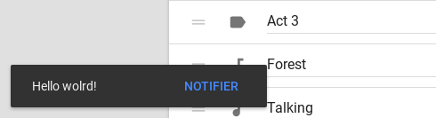

[](https://travis-ci.org/myfrom/Notifier)
[](https://www.webcomponents.org/element/@myfrom/Notifer)
[](https://myfrom.github.io/Notifier)


# Notifier
A lightweight library to show paper-toast and paper-dialog alerts easily.



## Usage

To use it you have to import [notifier](notifier.js) module.
```javascript
import Notifier from '@myfrom/notifier';
```
The module returns an initialised Notifier class on which you can use methods described in [docs](https://myfrom.github.io/Notifier)


### Custom options

You can set custom options before you load Notifier by setting `NotifierOptions` on `window`. Here are the default values:

```json
{
  "elementsImported": false, // If set to true, Notifier won't attempt to load its dependencies (check 'Loading dependencies' section).
  "stylesLoaded": false, //  Same but it's about helper styles (check 'Helper styles section').
  "mobileMediaQuery": ["(orientation: landscape) and (max-width: 960px)","(orientation: portrait) and (max-width: 600px)"] // To distinguish between phones and bigger devices. If changed you should also change it in styles.css
}
```

### Loading dependencies

Notifier relies on a few custom elements such as [paper-dialog](https://www.webcomponents.org/element/@Polymer/paper-dialog) and [paper-toast](https://www.webcomponents.org/element/@Polymer/paper-toast).

By default, they will be loaded using a dynamic import. You can ommit this loading attempt by setting `elementsImported` option to `true` (look above). However, if you do this and not import necessary files, Notifier will throw an error.

Here are all the necessary files for each function:

<details>
  <summary>`showToast()`</summary>
  <ul>
    <li>paper-toast</li>
    <li>paper-button</li> (if includes a button)
  </ul>
</details>
<details>
  <summary>`showDialog()`</summary>
  <ul>
    <li>paper-dialog</li>
    <li>paper-dialog-scrollable</li>
  </ul>
</details>
<details>
  <summary>`askDialog()`</summary>
  <ul>
    <li>paper-dialog</li>
    <li>paper-dialog-scrollable</li>
    <li>paper-button</li> 
  </ul>
</details>
<details>
  <summary>Animations</summary>
  <ul>
    <li>neon-animation/web-animations.html</li>
    <li>neon-animation/animations/fade-in-animation.html</li>
    <li>neon-animation/animations/fade-out-animation.html</li>
    <li>neon-animation/animations/slide-from-bottom-animation.html</li>
    <li>neon-animation/animations/slide-down-animation.html</li>
  </ul>
</details>

They are also exported as an array from notifier module (`elementsToImport`).

### Helper styles

Notifier relies on a few styles applied to paper-button in paper-toast. Those styles are not mandatory but ensure there are no weird bugs such as text overlapping with button, etc.

They're automatically loaded but you can skip that by setting `stylesLoaded` option to `true`). In such case you might want to manually add [styles.css](./styles.css) to your document.